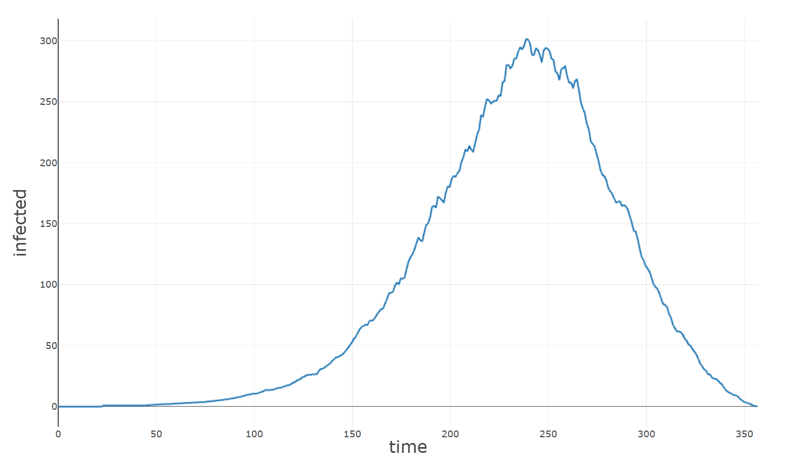

# Motivation
All of these models were created in one day or less, in order to prepare for competitions such as the MCM and the HiMCM. 
These competitions require not only good models, but also a lot of knowledge on a variety of models. As such, all of the ideas (created with ChatGPT) can be solved with a variety of models.
All of the code is in c++ and research AND code had to be conducted in one day, in order to meet the speed requirements that these competitions have. Additionally, this training forces me to learn a variety of models for different use cases.
As a personal rule, I don't use any libraries except for the std libraries, in order to force myself to learn more key concepts and really learn the implementations deeply. 

## Model 1: Pandemic Modeling (SEIRD) 
### Summary
Date: 11/24/2024 (Research & Code in 1 day)
 
 
The problem is to find a way to model the spread of outbreaks and epidemics. Especially since the COVID-19 pandemic, it is a pressing issue to determine how to calculate the spread and quantify the effects of measures such as social distancing.
Common models used are compartmental models, which is implemented with multiple different variations here. Compartmental modals split the population into different groups, such as infected or susceptible, and use these groups to model how a disease progresses. While the implementation is simple, it's able to demonstrate the basic shape of epidemics and has multiple variables that can be modified. Using these models, I created a lot of extensions to have more and more features, so there's even more data that can be analyzed to see how a disease progresses.
The implementations are as follows, with each building off the last:
1. An ODE implementation of SIR
2. A stochastic version of model 1
3. SIRD
4. SEIR(D)
<!---->
All of them give similar graphs and have their own strengths and advantages, and the hope is to get familiar with these models.  

### Analysis
 The data shows a typical epidemic - people get exposed, slowly building up the exposed population, which is then reflected into the infected population. The epidemic peaks, and then goes back down as people recover or die. The model is able to generate a variety of graphs like this, predicting a random outcome that could occur, given infection rates and recovery/mortality rates. This graph is commonly accepted as a "normal" epidemic, and is a great, simple model to explain the progress and stages of an epidemic.

### Strengths
The "best" model is the SEIRD model, so the strengths are mainly on that one. SEIRD is able to model a lot of epidemics, with deaths, exposure, latency times which really increase it's accuracy - but as always, the model depends on a lot on how accurate the data you can feed into it is. It uses a deque to help model exposures and infections, and it still has a lot more features that can be added to improve. My implemenatation is also probabilistic, so you get the variance one would expect from random interactions and infection rates. The most important part is that this model sufficiently demonstrates the "curve" or trajectory that a typical epidemic would take, which is useful to see a variety of effects: for example, an extremely large latency time combined with a high transmission rate like COVID-19.

### Improvements
Some improvements that can be made are more realistic methods to simulate the variance, for example an actual simulation. Additionally, analytical methods can be used for all of the ODE versions. The most limiting factor is the inability to test this, there is no way to double check to see if the model will accurately predict how an epidemic progresses - it only produces a graph based on the input variables. Additionally, more functionality such as vaccinations or changing exposure times can really help model real life situations.

## Model 2: Deforestation pt. 1 
### Summary
Date: 11/27/2024 (Research & Code in 1 day)
 
 
To be completely honest, this model is gutter trash. Deforestation was a really difficult topic, especially since it's so nuanced that it's extremely hard to model well in one day - but that's exactly why I'm doing this. This model in particular was research intensive, as the model design was way more difficult than the actual implementation. At first, I was going to go with an economic-centric design, but then it was a lot easier to just make a trend model as the goal was to predict the results of deforestation.
The model is extremely simple, just a linear trend, with a lot of unit conversions to calculate the CO2 emissions, temperature growth, and the tree loss. It outputs a predicted temperature growth due to deforestation for 60 years.
This model will probably be redone when I have a chance to.

### Analysis

The data shows that as deforestation trends continue to increase, eventually deforestation will account for a 0.8 celsius increase in global temperatures. An interesting thing to note is that the curve is increasing, which means that the temperature growth will continue to accelerate as demand for land and trees increase - causing accelerated tree loss and deforestation.

### Strengths
The model is extremely simple, able to run quickly and have multiple extra features. The simplicity also helps with accuracy, as it's very hard to mess up the simple unit conversions. The model is also able to extrapolate from the predictions what the actual "hard" effects are - temperature growth and CO2 increases. It is very good at showing the effects.
Other than that, this model has barely any other strengths.

### Improvements
The model could use some more nuanced predictions, such as using forecasting methods such as the Holt-Winters method or other ways to predict the tree loss. Additionally, more features could be used. The base is also flawed, as there are better ways to model deforestation, such as an agent-based way or more simulation-based way to model deforestation. The model is only capable of giving a scenario assuming that current trends continue linearly, which may not occur. I believe that the model was too simple for such a complex problem, and it's one of the things I want to fix.

## Model 3.5: Titanic Predictions w/ Ridge Regression
Date: 12/3/2024 - 12/4/2024 (Code in 2 days)
 
 
This model was an application of a generalized linear regression model that I created over 12/1-12/2, which utilizes coordinate descent. The data used was from the Titanic competition on kaggle.com, so there was almost no research. The model was relatively easy to create, but since the values in the end had to be 0 or 1, I used a basic logistic regression by adding a cutoff value and rounding. After I found a reasonable solution, I continued on for another day to try to keep improving the solution even further with new functions.

### Analysis
Overall, the performance of this model is fine, with an R-squared of ~0.5 and an accuracy of around 80%, which puts this model (as of the date of writing) in the top quartile of models. The coordinate descent worked very fast and identified a "good" solution very quickly.I also implemented in simple ridge regularization, in order to minimize variance as I found that the model would overfit. Even after training to a higher r-squared, the model failed to produce high accuracy, so ridge regression improved variance, but lowered bias.

### Strengths
Since the model is a logistic regression, cutoff values can also be optimized, which helps to improve accuracy as the model does not have to be exact. Additionally, the linear regression sufficiently models basic relationships very well. This allows it to have a high accuracy rate, nearly 80% with a short training period and a simple model - which is important for short competitions. This shows how powerful linear regression is, and gives me a good tool for a wide variety of future competitions.

### Improvements
Mst of the relationships aren't linear, so the linear regression fails to model these complex relatioships. Additionally, the model could be improved to further minimize bias, with more features or going into polynomial regressions. The generalized linear regression that this model is built on could be optimized to become true generalized regression, able to also have bayesian or different stochastic models. 

## Model 4: Traffic Flow Optimization
### Summary
Date: 10/29/2025 (Research & Code in 1 day, with Lawrence)
 
 
### Analysis
The problem was to optimize traffic flow, and the way we thought about it was that you had multiple roads (states) and you have a transition matrix that represents the possible intersections, and how many people move through each intersection. Our idea was to use some kind of app to route people, thus changing this transition matrix by affecting how many people move from one road to another. We also added a capacity constraint, which is the goal that we modeled around as our top priority to avoid congestion.
The idea is to then build on top of this simulation by adding some other tasks, such as sinks (which shows if someone made it through a goal) and also sources (adding more to the simulation) and then optimize it given these new constraints.

### Method
Let $s$ be the road state, with $s_i$ denoting the amount of cars on road $i$. Let $c$ be the capacity, where each element $c_i$ denotes the capacity of road $i$. An easy way to create a transition matrix $M$ such that $\lim\limits_{t \to \infty} sM^t=c$ when $t \rightarrow \infty$ is to make $M=c \cdot1^T$, where $1^T$ denotes the row vector of ones of the same dimension as $c$. As such, $M$ becomes a square matrix with columns are equal to $c$. This means that when the state updates: $s_nM^t=s_{n+1}$, $s_{n+1}$ will have each of its elements become proportional to $c$. We improve this by adding an dampening term, $\alpha$, and define the final model as $s_{n+1}=\alpha I+(1-\alpha)(c \cdot 1^Ts_{n})$, where the coefficient $\alpha$ allows us to specifiy how much of the state $s$ we pass in remains the same (due to the identity matrix), slowing down the change to $c$.
### Strengths
A strength of the model is that it provides a strong theoretical framework for further models to build upon. The conceptual idea of having a transition matrix is really useful to perform additional mathematical analysis, and already this model offers us some potential benefits, as we can simulate a typical city and then compute a neccesary change to reduce congestion. 
### Improvements
Most of the improvements we could make are additional submodels: a lot of key aspects of traffic/driving are not modeled here. Primarily, the fact that we do not have a target goal means that the cars' movement is effectively random. More aspects of the problem that aren't simulated are car crashes/accidents increasing congestion, traffic lights as another method to control traffic, car speeds, and more traffic rules such as U-turns. 

## Model 5: Modeling Seasonal Energy Demands
Date: 10/30/2025 (Research & Code in 1 day)
 
 

### Method
The data was gathered from publically available data of total energy consumption in Canada (which was chosen because it actually looked periodic). The problem was to simply model the seasonal patterns, and as such we just used a Holt-Winters model (which was implemented poorly, thus making it have inaccurate future predictions).
The Holt-Winters model is ultimately pretty simple, utilizing simple exponential smoothing - let our variables be $l_t,b_t,s_t$ for the "level" (baseline), the trend, and the seasonal variation respectively. Let $y_t$ be the actual values, and let $\alpha,\beta,\gamma$ be smoothig coefficients. The Holt-Winters model is ultimately just updating these with the following equations:
$\ell_t = \alpha (y_t - s_{t-m}) + (1 - \alpha)(\ell_{t-1} + b_{t-1})$ 
$b_t = \beta (\ell_t - \ell_{t-1}) + (1 - \beta)b_{t-1}$ 
$s_t = \gamma (y_t - \ell_t) + (1 - \gamma)s_{t-m}$ 
The level is defined by the value without the seasonal adjustment, adjusted with the last baseline and the last trend.
The trend is the difference in levels, with a portion dedicated to the past trend (simple exponential smoothing) to make it "remember" the past trends. Finally, the seasonal level is simply the current value minus the level, again smoothed with past seasonal adjustments (offset by $m$).

### Strengths
A key strength of the model is simply the fact that it works. Holt-Winters is an "off the shelf" model, but we clearly see that it works, with a median error of ~500, or around 1.25% after training. It does manage to capture the seasonal trends, and by looking at the seasonal levels we can analyze the actual absolute effect that these seasonal changes have on energy consumption. 

### Improvements
One of the main improvements that is neccesary is to correctly and cleanly implement the code. The current model is implemented awfully, and could be fixed to actually perform the expected task much better. Another improvement that could be made is tuning the hyperparameters until it fits the data the best.:
Finally, while Holt-Winters is amazing for periodic data, we could make this model more specific for energy usage by making a submodel to predict energy usage given other factors and not just time.

### Analysis
The model ends up solving the problem, but there are a lot of key issues with implementation holding it back.
However, even this really, *really* bad implementation still shows the power of Holt-Winters, a median error of 1.25% is extremely small, and for any kind of periodic data Holt-Winters could be extremely powerful. Overall, the model does end up being able to model the seasonal energy demands over a period of time, but the "why" of these seasonal patterns isn't really answerable without deeper analysis into the underlying factors with a predictive model.
