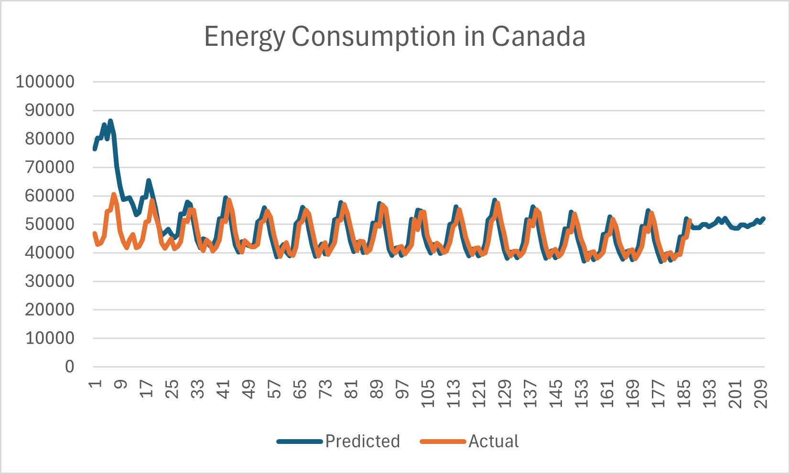

# Summary
Date: 10/30/2025 (Research & Code in 1 day)
 
 

## Method
 
The data was gathered from publically available data of total energy consumption in Canada (which was chosen because it actually looked periodic). The problem was to simply model the seasonal patterns, and as such we just used a Holt-Winters model (which was implemented poorly, thus making it have inaccurate future predictions).
The Holt-Winters model is ultimately pretty simple, utilizing simple exponential smoothing - let our variables be $l_t,b_t,s_t$ for the "level" (baseline), the trend, and the seasonal variation respectively. Let $y_t$ be the actual values, and let $\alpha,\beta,\gamma$ be smoothig coefficients. The Holt-Winters model is ultimately just updating these with the following equations:
$\ell_t = \alpha (y_t - s_{t-m}) + (1 - \alpha)(\ell_{t-1} + b_{t-1})$ 
$b_t = \beta (\ell_t - \ell_{t-1}) + (1 - \beta)b_{t-1}$ 
$s_t = \gamma (y_t - \ell_t) + (1 - \gamma)s_{t-m}$ 
The level is defined by the value without the seasonal adjustment, adjusted with the last baseline and the last trend.
The trend is the difference in levels, with a portion dedicated to the past trend (simple exponential smoothing) to make it "remember" the past trends. Finally, the seasonal level is simply the current value minus the level, again smoothed with past seasonal adjustments (offset by $m$).

## Strengths
A key strength of the model is simply the fact that it works. Holt-Winters is an "off the shelf" model, but we clearly see that it works, with a median error of ~500, or around 1.25% after training. It does manage to capture the seasonal trends, and by looking at the seasonal levels we can analyze the actual absolute effect that these seasonal changes have on energy consumption. 

## Improvements
One of the main improvements that is neccesary is to correctly and cleanly implement the code. The current model is implemented awfully, and could be fixed to actually perform the expected task much better. Another improvement that could be made is tuning the hyperparameters until it fits the data the best.:
Finally, while Holt-Winters is amazing for periodic data, we could make this model more specific for energy usage by making a submodel to predict energy usage given other factors and not just time.

## Analysis
The model ends up solving the problem, but there are a lot of key issues with implementation holding it back.
However, even this really, *really* bad implementation still shows the power of Holt-Winters, a median error of 1.25% is extremely small, and for any kind of periodic data Holt-Winters could be extremely powerful. Overall, the model does end up being able to model the seasonal energy demands over a period of time, but the "why" of these seasonal patterns isn't really answerable without deeper analysis into the underlying factors with a predictive model.
