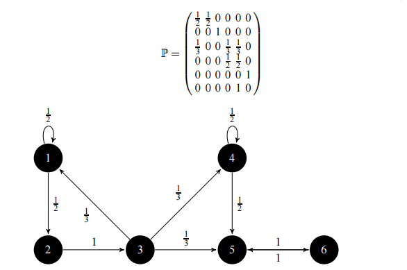

# Summary
Date: 10/29/2025 (Research & Code in 1 day, with Lawrence)
 
 
## Analysis
 
The problem was to optimize traffic flow, and the way we thought about it was that you had multiple roads (states) and you have a transition matrix that represents the possible intersections, and how many people move through each intersection. Our idea was to use some kind of app to route people, thus changing this transition matrix by affecting how many people move from one road to another. We also added a capacity constraint, which is the goal that we modeled around as our top priority to avoid congestion.
The idea is to then build on top of this simulation by adding some other tasks, such as sinks (which shows if someone made it through a goal) and also sources (adding more to the simulation) and then optimize it given these new constraints.

## Method
Let $s$ be the road state, with $s_i$ denoting the amount of cars on road $i$. Let $c$ be the capacity, where each element $c_i$ denotes the capacity of road $i$. An easy way to create a transition matrix $M$ such that $\lim\limits_{t \to \infty} sM^t=c$ when $t \rightarrow \infty$ is to make $M=c \cdot1^T$, where $1^T$ denotes the row vector of ones of the same dimension as $c$. As such, $M$ becomes a square matrix with columns are equal to $c$. This means that when the state updates: $s_nM^t=s_{n+1}$, $s_{n+1}$ will have each of its elements become proportional to $c$. We improve this by adding an dampening term, $\alpha$, and define the final model as $s_{n+1}=\alpha I+(1-\alpha)(c \cdot 1^Ts_{n})$, where the coefficient $\alpha$ allows us to specifiy how much of the state $s$ we pass in remains the same (due to the identity matrix), slowing down the change to $c$.
## Strengths
A strength of the model is that it provides a strong theoretical framework for further models to build upon. The conceptual idea of having a transition matrix is really useful to perform additional mathematical analysis, and already this model offers us some potential benefits, as we can simulate a typical city and then compute a neccesary change to reduce congestion. 
## Improvements
Most of the improvements we could make are additional submodels: a lot of key aspects of traffic/driving are not modeled here. Primarily, the fact that we do not have a target goal means that the cars' movement is effectively random. More aspects of the problem that aren't simulated are car crashes/accidents increasing congestion, traffic lights as another method to control traffic, car speeds, and more traffic rules such as U-turns. 

